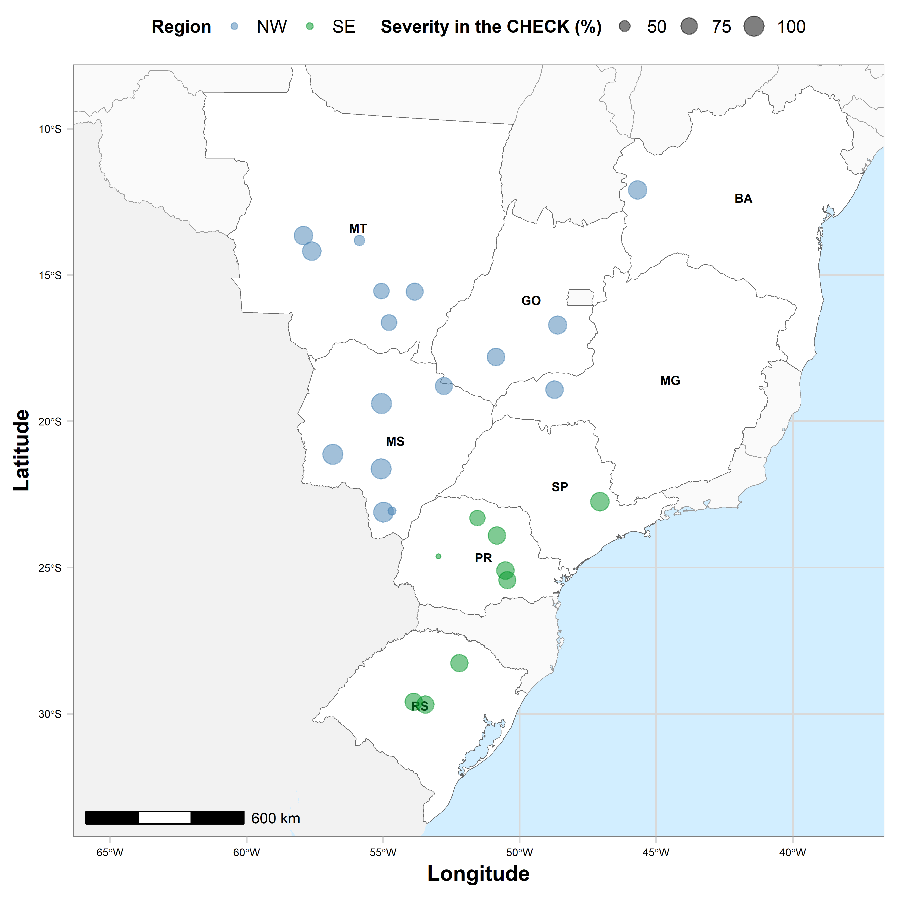

## About

This website provides easy access to commented R scripts that allows reproducing the analysis of the data from our publication.

In this study, we used a network meta-analytic approach to estimate the overall increase in control efficacy of Soybean Rust (SBR) (caused by *Phakopsora pachyrhizi*), and most importantly, the overall yield return provided by the additional application of multi-site fungicides (chlorothalonil, copper oxychloride and mancozeb) in a set of premixes of QoI plus DMI or SDHI fungicides evaluated during three growing seasons (2014/15 to 2017/18) across 25 locations in Brazil. Additionally, we further used the mean and uncertainty of the meta-analytic estimates in risk analysis for aiding decision making with regards to the profitability of multi-site addition under a range of scenarios. 

 

Code: [MIT](https://opensource.org/licenses/MIT) year: 2021, copyright holder: Emerson Del Ponte

